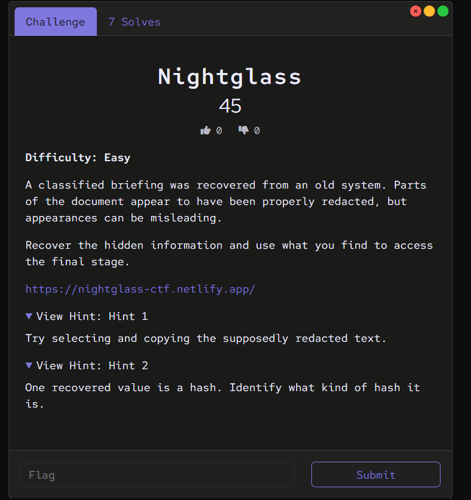

# Nightglass

**CTF:** Cyberspectre, September 2026
**Category:** [Misc]
**Difficulty:** Easy
**Flag:** `cyberspectre{fake_redaction_is_not_security_2026}`

## Challenge description

A classified briefing was recovered from an old system. Parts of the document appear to have been properly redacted, but appearances can be misleading.

Recover the hidden information and use what you find to access the final stage.

Link: https://nightglass-ctf.netlify.app/

**Hint 1:** Try selecting and copying the supposedly redacted text.

**Hint 2:** One recovered value is a hash. Identify what kind of hash it is.

## Tools used
- Web browser and PDF viewer
- Notepad (any plain text editor)
- Browser DevTools (F12)
- `sha1sum`, Python, or CrackStation for the hash check

## Initial recon
I read the challenge text and hints before touching anything.

- **"Redacted"** means text was blacked out to hide it. The description says "appearances can be misleading", and Hint 1 says to copy the redacted text. Together they suggest the black boxes only cover the text visually.
- **"Access the final stage"** means the site has a step that needs a secret from the briefing.
- **Hint 2** says one recovered value is a hash, so I will need to work out the hash type and turn it back into the original text.

The site shows a briefing PDF with black bars over some lines. I found two ways to get the answer.

## Solution
Method 1 is the path the challenge was designed around, and it uses both hints. Method 2 is a shortcut that works because of a second mistake in the site.

### Method 1: recover the redacted text, then crack the hash

**Step 1: understand why the black bars fail**

A black bar in a PDF is a separate shape drawn on top of the text. The text itself is still stored in the file underneath, and the PDF viewer can still select it. Proper redaction deletes the text from the file. This document only covered it.

**Step 2: copy the hidden text into Notepad**

1. Open the briefing PDF.
2. Press `Ctrl + A` to select everything, then `Ctrl + C` to copy. (On a Mac, use `Cmd` instead of `Ctrl`.) You can also drag your mouse across the black bars to select only those lines.
3. Open Notepad and press `Ctrl + V` to paste.

I used Notepad because it is a plain text editor. It shows the raw characters and has no black boxes, so the hidden lines are readable. Comparing the pasted text with the PDF shows which lines were hidden.

If the text will not select, press `Ctrl + F` in the PDF viewer and search for a word you expect, such as `PASSPHRASE`. A match on a blacked-out line confirms the text is really there. On Linux, `pdftotext briefing.pdf -` prints all the text in the file, including covered text.

**Step 3: read what was hidden**

```
PRIMARY PASSPHRASE: Security2026!
TARGET HASH (SHA-1): 54c20c4b971eb88cca4fd3d9cb4472307ef125a4
```

This gives two pieces: a passphrase, and a hash of something else I still need.

**Step 4: identify the hash type (Hint 2)**

The PDF labelled the hash SHA-1, but I checked it myself. Hash types have different lengths, and the length is the first clue:

| Hash type | Length in hex characters |
|---|---|
| MD5 | 32 |
| SHA-1 | 40 |
| SHA-256 | 64 |
| SHA-512 | 128 |

The target hash has 40 characters, so it matches SHA-1. RIPEMD-160 also has 40 characters, but it is rare, and the PDF labelled this one SHA-1. A hash identifier tool (`hashid` on Linux, or any online "hash identifier" page) gives the same answer. The final proof comes in the next step: if hashing a guess gives the exact target hash, the type is confirmed.

**Step 5: turn the hash back into text**

A hash is a one-way function, so it cannot be run backwards. To crack it, you guess a word, hash the guess, and compare it with the target. There are three ways to do that:

- **Lookup site.** CrackStation (https://crackstation.net) keeps huge lists of common words that are already hashed. Paste the hash and it returns the word if the word is in its list.
- **Wordlist attack.** The tool `hashcat` hashes every word in a list and compares it with the target. SHA-1 is mode 100:
  ```
  hashcat -m 100 -a 0 hash.txt wordlist.txt
  ```
- **Check a candidate yourself.** Once you have a candidate word, hash it and compare the result with the target. Here the candidate `admin_access` also appears in the site's JavaScript (see Method 2). Hash it and compare with the target:

  Linux, macOS, or WSL:
  ```
  echo -n "admin_access" | sha1sum
  ```
  Python:
  ```python
  import hashlib
  print(hashlib.sha1(b"admin_access").hexdigest())
  ```
  Windows PowerShell:
  ```
  $b = [System.Text.Encoding]::UTF8.GetBytes("admin_access")
  $h = [System.Security.Cryptography.SHA1]::Create().ComputeHash($b)
  ($h | ForEach-Object { $_.ToString("x2") }) -join ""
  ```

All three print:

```
54c20c4b971eb88cca4fd3d9cb4472307ef125a4
```

This is the target hash, so the hash is the SHA-1 of `admin_access`. It also confirms the type is SHA-1.

The `-n` in the first command matters. Without it, `echo` adds a new line to the end of the text, and that extra character produces a completely different hash.

**Step 6: fill in the credential form**

The final-stage form asks for two things: the passphrase and the unhashed secret.

| Field | Value | Where it came from |
|---|---|---|
| Passphrase | `Security2026!` | Recovered from the PDF |
| Unhashed secret | `admin_access` | The text behind the hash |

The `!` at the end belongs to the passphrase, not to the secret. The site's JavaScript joins the two values into one string, `Security2026!admin_access` (see Method 2), which is why it looks like a single word. Entering the two values unlocked the flag.

### Method 2: read the answer from the page's JavaScript

1. Open https://nightglass-ctf.netlify.app/
2. Press `F12`, or right-click the page and choose **Inspect**. This opens DevTools.
3. In Chrome or Edge, open the **Sources** tab. In Firefox, open the **Debugger** tab. Find the page's JavaScript file, or the script inside the page's HTML.
4. Search all the code. In Chrome or Edge, press `Ctrl + Shift + F` and search for `EXPECTED`. Pressing `Ctrl + U` opens the page source, where `Ctrl + F` also works.
5. I found these lines:
   ```js
   const EXPECTED = "Security2026!admin_access";
   const FLAG = "cyberspectre{fake_redaction_is_not_security_2026}";
   ```

`EXPECTED` is the passphrase and the unhashed secret from Method 1 joined together, and `FLAG` is the flag.

This works because the browser has to download the JavaScript to run it, so everything in the file is visible to the visitor. The site compares my input with the answer inside my own browser, so the answer and the flag are both readable in the code.

### How hash cracking works

A hash cannot be reversed, so cracking is a guess-and-compare loop:

1. Pick a candidate value.
2. Hash it with the same algorithm as the target (SHA-1 here).
3. Compare the result with the target hash.
4. If all 40 characters match, the candidate is the original text. If not, try the next candidate.

There are two ways to generate candidates:

- **Wordlist (dictionary) attack.** Test a list of likely words and phrases, such as common passwords. This is fast because people choose predictable text. A value like `admin_access` is the kind of text a wordlist can contain.
- **Brute force.** Test every combination of a character set up to a set length. It always works in the end, but the number of guesses grows quickly:

| Character set and length | Number of guesses | Time at 10 billion guesses per second |
|---|---|---|
| 4 lowercase letters | 456,976 | under a millisecond |
| 8 lowercase letters | about 208 billion | about 21 seconds |
| 12 characters from lowercase letters plus `_` (like `admin_access`) | about 150 quadrillion | about 174 days |

A modern graphics card can test roughly 10 billion or more SHA-1 guesses per second with `hashcat`. Brute force is practical only for short values, so a wordlist is the first thing to try.

### Ways to match a value against the hash

Target hash used in every example: `54c20c4b971eb88cca4fd3d9cb4472307ef125a4`

**1. Terminal, one candidate, automatic comparison (Linux, macOS, WSL)**

```
[ "$(echo -n admin_access | sha1sum | cut -d' ' -f1)" = "54c20c4b971eb88cca4fd3d9cb4472307ef125a4" ] && echo MATCH
```

It prints `MATCH` only when the two hashes are identical, so you do not have to compare 40 characters by eye.

**2. Python, one candidate**

```python
import hashlib
target = "54c20c4b971eb88cca4fd3d9cb4472307ef125a4"
print(hashlib.sha1(b"admin_access").hexdigest() == target)
```

It prints `True` for a match and `False` for anything else.

**3. Python, a whole wordlist**

Save your candidates in `wordlist.txt`, one per line, then run:

```python
import hashlib
target = "54c20c4b971eb88cca4fd3d9cb4472307ef125a4"
with open("wordlist.txt") as f:
    for line in f:
        word = line.strip()
        if hashlib.sha1(word.encode()).hexdigest() == target:
            print("Match found:", word)
            break
    else:
        print("No match in this wordlist")
```

I tested this with a five-word list that included `admin_access`, and it printed `Match found: admin_access`.

**4. CyberChef (no install)**

1. Open https://gchq.github.io/CyberChef/
2. Search for **SHA1** and double-click it.
3. Type a candidate into the **Input** box.
4. Compare the **Output** with the target hash.

This checks one candidate at a time.

**5. Online lookup: CrackStation**

Paste the target hash into https://crackstation.net. The site compares it with huge lists of already-hashed words and returns the text if it has the hash. If it finds nothing, the value is not in its lists.

**6. Cracking tools for many candidates**

`hashcat` with a wordlist (SHA-1 is mode 100):

```
hashcat -m 100 -a 0 hash.txt wordlist.txt
```

`hashcat` brute force with a mask, where each `?l` means one lowercase letter (this tries every 8-letter lowercase value):

```
hashcat -m 100 -a 3 hash.txt ?l?l?l?l?l?l?l?l
```

John the Ripper with a wordlist:

```
john --format=raw-sha1 --wordlist=wordlist.txt hash.txt
```

In these commands, `hash.txt` is a text file that contains only the target hash.

**Common mistakes that stop a match**
- A hidden new line. `echo` without `-n` adds one, and it changes the hash completely.
- An extra space at the end of the text, or Windows line endings (`\r`) in a wordlist file.
- The wrong algorithm. The MD5 hash of `admin_access` will not match a SHA-1 target.
- The wrong letter case in the text. `Admin_access` and `admin_access` give different hashes. Upper or lower case in the hash itself does not matter.

### Comparing the two methods

| | Method 1 | Method 2 |
|---|---|---|
| Uses | PDF text copy, hash identification, hash cracking | Browser DevTools |
| Speed | Slower | Faster |
| What it shows | The intended path and both hints | A second mistake in the site |

## Dead ends
- None.

## Vulnerability / technique
This challenge has two weaknesses.

1. **Fake redaction (information disclosure, CWE-200).** The black bars were drawn over the text, and the text stayed in the file. Anyone who selects and copies the page can read it.
2. **Client-side check (CWE-602).** The site compares the answer inside the browser, so the expected value and the flag are in the JavaScript that every visitor downloads.

The hash was also weak protection. SHA-1 is fast to compute, and `admin_access` is a short, predictable string. A lookup table or a wordlist finds it quickly.

## Fix / defense
- **Redact properly.** Use the redaction tool in a PDF editor such as Adobe Acrobat, which deletes the covered text from the file. Then test the result: select all, copy, and paste into Notepad to check nothing is left. In January 2019, a court filing in the Paul Manafort case used black boxes that could be copied out, which exposed the text underneath.
- **Check answers on the server.** Never put a password, an expected value, or a flag in JavaScript. The server should compare the input and return a result only when it is correct.
- **Store passwords with a slow, salted hash.** Use bcrypt or Argon2 instead of plain SHA-1.
- **SOC relevance.** Identifying a hash type is a daily SOC task. Analysts search file hashes (usually SHA-256, sometimes MD5 or SHA-1) on VirusTotal to check whether a file is known malware.

## Lessons learned
- A black box over text does not remove the text. Select and copy is the first test for any redacted document.
- Hash length identifies the type: 32 characters is MD5, 40 is SHA-1, 64 is SHA-256.
- A hash cannot be reversed. It is cracked by guessing words and comparing hashes.
- Use `echo -n` when hashing text in the terminal, because a hidden new line changes the hash.
- Check the page's JavaScript in DevTools. Anything the browser runs is visible to the user.

## References
- CrackStation: https://crackstation.net
- CyberChef (has hash operations such as SHA1): https://gchq.github.io/CyberChef/
- hashcat hash modes: https://hashcat.net/wiki/doku.php?id=example_hashes
- CWE-602, Client-Side Enforcement of Server-Side Security: https://cwe.mitre.org/data/definitions/602.html