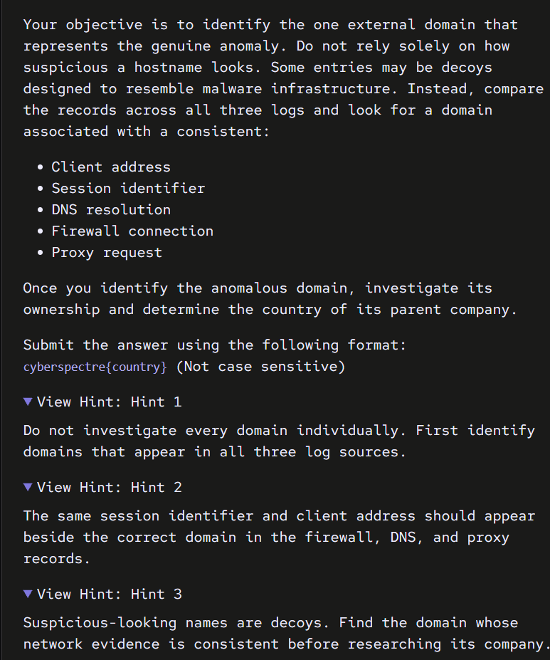

# Suspect Network Log — Writeup

**CTF:** Cyberspectre, September 2026
**Category:** Network Forensics / OSINT
**Difficulty:** Hard
**Flag format:** `cyberspectre{country}`

## What we're given


Three separate log exports covering the same time window, all pulled from a workstation suspected of talking to an external server:

- `firewall.log` — 10,000 lines, perimeter firewall connection records
- `dns_queries.log` — 3,001 lines, DNS resolver log
- `proxy_access.log` — 2,003 lines, web proxy access log

Each log records a different point in the same network journey. A real web connection leaves a trace in all three, in this order:

1. **DNS log** — the machine asks "what's the IP for this domain?"
2. **Firewall log** — the actual TCP connection gets made to that IP
3. **Proxy log** — the web request itself goes out

Each log also shares three fields that let you tie records together across files: a **session ID**, a **client/source IP**, and the **hostname** being contacted. That's the whole basis of this challenge: find the one domain where all three logs agree on the same session and client, at the same point in time.

Most of the traffic is background noise, real services like Google, Microsoft, GitHub, CDNs, and update servers, plus a handful of domains built to look like malware infrastructure but aren't.

## Part 1: Why you can't just eyeball suspicious names

Names like `cloud-login-support.org`, `system-health-check.net`, `content-delivery-status.com`, and `media-cache-service.org` all sound exactly like command-and-control infrastructure. That's intentional, they're decoys designed to bait you into investigating the scariest name first.

Checking how often each one appears across the three logs tells a different story:

| Domain | Firewall hits | DNS hits | Proxy hits |
|---|---|---|---|
| cloud-login-support.org | 127 | 40 | 19 |
| system-health-check.net | 130 | 33 | 26 |
| content-delivery-status.com | 126 | 31 | 29 |
| media-cache-service.org | 102 | 35 | 24 |

These domains appear dozens to hundreds of times, scattered across many different sessions and client machines. That's what real background noise looks like: high volume, no single consistent thread tying one specific event together. An attacker's real check-in traffic tends to be quiet, not loud.

## Part 2: The correlation method, explained

The actual approach isn't "which domain looks worst," it's "which domain is provably the same event across all three logs." That means the same session ID and the same client IP need to appear beside that hostname in the firewall log, the DNS log, and the proxy log, all within seconds of each other.

This is a three-stage filter:

1. **Which hostnames appear in all three logs at all?** (Narrows thousands of lines to ~50 candidates)
2. **Of those, which ones have a session ID that's shared across all three logs for the same host?** (Narrows ~50 down to a handful)
3. **Manually confirm the match**, same client IP, timestamps in the right order

### Linux / WSL version

If you're on WSL, grep and a short Python script do this cleanly.

**Check occurrence counts (spot the decoys):**
```bash
grep -c "host=cloud-login-support.org" firewall.log
```

**Pull unique hostnames from each log:**
```bash
grep -oP 'host=\K\S+' firewall.log | sort -u > fw_hosts.txt
grep -oP 'query=\K\S+' dns_queries.log | sort -u > dns_hosts.txt
grep -oP 'host=\K\S+' proxy_access.log | sort -u > proxy_hosts.txt
```

**Find hostnames common to all three:**
```bash
comm -12 fw_hosts.txt dns_hosts.txt | comm -12 - proxy_hosts.txt
```

**Correlate session IDs per domain (Python):**
```python
import re
from collections import defaultdict

def parse(path, pattern):
    entries = []
    with open(path) as f:
        for line in f:
            m = re.search(pattern, line)
            if m:
                entries.append((m.group(1), m.group(2)))  # session, host
    return entries

fw = parse('firewall.log', r'session=(\S+) src=\S+ dst=[\d.]+:\d+ .*host=(\S+)')
dns = parse('dns_queries.log', r'session=(\S+) client=\S+ query=(\S+)')
proxy = parse('proxy_access.log', r'session=(\S+) client=\S+ host=(\S+)')

def sessions_by_host(entries):
    d = defaultdict(set)
    for session, host in entries:
        d[host].add(session)
    return d

fw_map, dns_map, proxy_map = sessions_by_host(fw), sessions_by_host(dns), sessions_by_host(proxy)
common_hosts = set(fw_map) & set(dns_map) & set(proxy_map)

for host in common_hosts:
    shared = fw_map[host] & dns_map[host] & proxy_map[host]
    if shared:
        print(host, shared)
```

**Confirm the match by hand:**
```bash
grep "S9X17" firewall.log dns_queries.log proxy_access.log
```

### Windows PowerShell version

Same logic, no WSL or Linux needed.

**Check occurrence counts:**
```powershell
(Select-String -Path firewall.log -Pattern "host=cloud-login-support.org").Count
```

**Pull unique hostnames from each log:**
```powershell
$fwHosts = Select-String -Path firewall.log -Pattern 'host=(\S+)' | ForEach-Object { $_.Matches.Groups[1].Value } | Sort-Object -Unique
$dnsHosts = Select-String -Path dns_queries.log -Pattern 'query=(\S+)' | ForEach-Object { $_.Matches.Groups[1].Value } | Sort-Object -Unique
$proxyHosts = Select-String -Path proxy_access.log -Pattern 'host=(\S+)' | ForEach-Object { $_.Matches.Groups[1].Value } | Sort-Object -Unique
```

**Find hostnames common to all three:**
```powershell
$common = $fwHosts | Where-Object { $dnsHosts -contains $_ -and $proxyHosts -contains $_ }
```

**Build session maps per log and intersect them:**
```powershell
$fwMap = @{}
Select-String -Path firewall.log -Pattern 'session=(\S+) src=\S+ dst=[\d.]+:\d+ .*host=(\S+)' | ForEach-Object {
    $session = $_.Matches.Groups[1].Value
    $h = $_.Matches.Groups[2].Value
    if (-not $fwMap.ContainsKey($h)) { $fwMap[$h] = [System.Collections.Generic.HashSet[string]]::new() }
    [void]$fwMap[$h].Add($session)
}

$dnsMap = @{}
Select-String -Path dns_queries.log -Pattern 'session=(\S+) client=\S+ query=(\S+)' | ForEach-Object {
    $session = $_.Matches.Groups[1].Value
    $h = $_.Matches.Groups[2].Value
    if (-not $dnsMap.ContainsKey($h)) { $dnsMap[$h] = [System.Collections.Generic.HashSet[string]]::new() }
    [void]$dnsMap[$h].Add($session)
}

$proxyMap = @{}
Select-String -Path proxy_access.log -Pattern 'session=(\S+) client=\S+ host=(\S+)' | ForEach-Object {
    $session = $_.Matches.Groups[1].Value
    $h = $_.Matches.Groups[2].Value
    if (-not $proxyMap.ContainsKey($h)) { $proxyMap[$h] = [System.Collections.Generic.HashSet[string]]::new() }
    [void]$proxyMap[$h].Add($session)
}

foreach ($h in $fwMap.Keys) {
    if ($dnsMap.ContainsKey($h) -and $proxyMap.ContainsKey($h)) {
        $shared = [System.Collections.Generic.HashSet[string]]::new($fwMap[$h])
        $shared.IntersectWith($dnsMap[$h])
        $shared.IntersectWith($proxyMap[$h])
        if ($shared.Count -gt 0) {
            Write-Host "$h -> $($shared -join ', ')"
        }
    }
}
```

**Confirm the match by hand:**
```powershell
Select-String -Path firewall.log,dns_queries.log,proxy_access.log -Pattern "S9X17"
```

### What both methods return

Only four domains have a session ID shared across all three logs:

```
akamai.net       -> S0963
wikipedia.org    -> S1294
live.com         -> S0998
ttgholidays.com  -> S9X17
```

Three are recognizable, mainstream services, expected legitimate traffic. `ttgholidays.com` is the outlier: not a well-known site, and not one of the scary decoy names either. That's exactly the profile a real anomaly should have, generic enough to slip past a quick scan.

## Part 3: How `ttgholidays.com` becomes hard evidence, not just a guess

Finding it in the intersection isn't proof by itself, it's a lead. Here's what turns it into evidence:

**Pull every line mentioning that session ID:**
```
firewall.log:     session=S9X17 src=10.14.12.19 dst=54.145.180.72:443 host=ttgholidays.com
dns_queries.log:  session=S9X17 client=10.14.12.19 query=ttgholidays.com answer=185.237.145.91
proxy_access.log: session=S9X17 client=10.14.12.19 host=ttgholidays.com path=/api/v1/sync
```

Three things confirm this is one real, connected event rather than a coincidence:

1. **Same client IP** (`10.14.12.19`) in all three logs
2. **Timestamps within seconds of each other**, and in the right order: DNS resolves first, then the firewall logs the connection, then the proxy logs the request
3. **The session ID format itself.** Every other session in these logs is purely numeric (`S0638`, `S1315`). `S9X17` has a letter mixed into it, a small tell that this entry doesn't follow the normal pattern

Compare that to the decoy domains: each one appears under a different session ID almost every time it shows up. There's no single session tying one decoy's firewall entry to its DNS entry to its proxy entry. That's what rules them out, and what makes `ttgholidays.com`'s consistency meaningful rather than coincidental.

## Part 4: Getting from the domain to a country, the part that actually mattered

This is where it's easy to go down a wrong path, so here's the full reasoning, including the dead end.

### Dead end: IP WHOIS

The DNS log shows `ttgholidays.com` resolved to `185.237.145.91`. A domain WHOIS lookup on `ttgholidays.com` itself returns nothing, because it's a fictional domain built for this challenge and was never actually registered anywhere. So the natural next move is looking up the IP instead, since IPs are always assigned to a real organization.

Querying that IP through RIPE (the regional registry that owns the `185.x.x.x` range) returns:

```
netname: HOSTINGER-HOSTING
country: SG
org: ORG-HIL8-RIPE
```

This looks promising, but it's a dead end. Hostinger is a global shared hosting company (real-world headquarters in Lithuania, this specific IP block registered under their Singapore entity), and thousands of unrelated websites sit on the same shared infrastructure. Finding "the site is hosted on Hostinger" tells you almost nothing about who specifically owns the domain, it's the digital equivalent of finding out someone rents a mailbox at a UPS Store. It confirms where the server lives, not who runs the business.

### The actual answer: read the domain name as a clue

When infrastructure-level lookups (WHOIS, IP ownership) come back generic or unhelpful, the next move is treating the domain name itself as a research clue instead of a technical artifact.

`ttgholidays.com` breaks into two readable parts:

- `ttg` — likely an acronym or company initials
- `holidays` — a travel/tourism industry word

That pattern, initials plus industry term, is exactly how real travel companies name their domains. So the research step is searching that acronym alongside the industry:

```
"TTG Holidays" company India
```

Quotation marks matter here, they force the search engine to look for that exact phrase together rather than scattering the words across unrelated results.

### What that search turned up

Most results were noise, other unrelated Indian travel agencies with similar-sounding names. But one result was a real business news article: Flight Centre Travel Group (an Australian company) acquired Travel Tours Group (TTG), a travel company headquartered in Bengaluru, India, run by founder Shravan Gupta, specializing in leisure and corporate travel, foreign exchange, and MICE (meetings, incentives, conferences, and exhibitions) services.

`TTG` = Travel Tours Group. `Holidays` = their business, travel and leisure packages. The initials and the industry both line up with a real, named, sourced company. That's what makes it credible evidence rather than a coincidental name match, it's backed by a reported acquisition, a named founder, and a named headquarters city.

### Why this is the right layer to research

The lesson worth taking from this challenge: server infrastructure (hosting provider, IP block, WHOIS registrar) tells you where a website's data physically sits. It almost never tells you who owns the business behind it, especially with cheap shared hosting, which by design puts unrelated companies on the same servers. When that lookup dead-ends, the domain name itself, read for real-world naming patterns like acronyms or brand fragments, is often the stronger lead.

## Part 5: Final flag

```
cyberspectre{india}
```

## Full solve path summary

1. Understand the three logs each capture a different stage of the same connection (DNS then firewall then proxy), and that a genuine event should appear in all three under one shared session ID.
2. Rule out the scary-sounding decoy domains by checking their frequency, they show up hundreds of times across unrelated sessions, which is what background noise looks like, not a targeted anomaly.
3. Extract unique hostnames from all three logs and find the ones common to all three (~50 candidates), using either grep/Python on Linux/WSL or Select-String/PowerShell on Windows.
4. For each candidate, check whether a single session ID is shared across all three logs. Only four domains pass this filter, three are recognizable legitimate services, one (`ttgholidays.com`) is not.
5. Confirm the match by hand: same client IP, timestamps in the correct DNS then firewall then proxy order, and an oddly-formatted session ID (`S9X17`) compared to the all-numeric pattern everywhere else.
6. Attempt a WHOIS lookup on the domain itself, it returns nothing, since the domain was never really registered.
7. Look up the resolved IP instead via RIPE, this reveals only a generic shared hosting provider (Hostinger), which is a dead end for identifying ownership.
8. Read the domain name as a clue instead: `ttg` + `holidays` suggests a company acronym plus industry term.
9. Search `"TTG Holidays" company India`, and find a sourced business news article confirming TTG stands for Travel Tours Group, headquartered in Bengaluru, India.
10. Submit the flag: `cyberspectre{india}`.